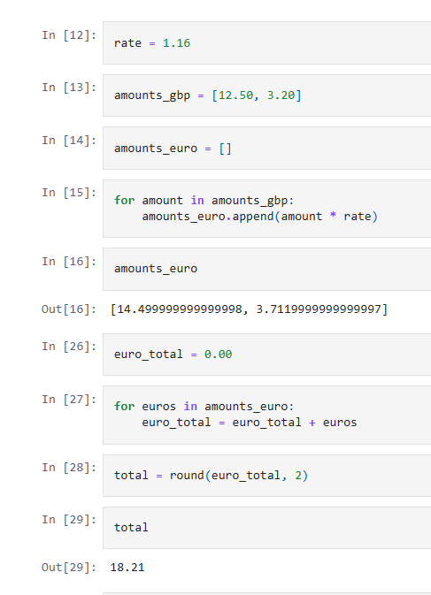

# Group-7
## Data Analysis Project: Currency Conversion Tool (GBP to EUR)

### Scenario:
Convert a couple of GBP amounts to EUR with a fixed rate.

 

## Table of Contents
- [Problem Statement](#problem-statement)
- [Solution](#solution)
- [Tasks](#tasks)
- [Data & Specifications](#data--specifications)
- [Installation](#installation)
- [Usage](#usage)
- [Team](#team)
- [Future Improvements](#future-improvements)

 

## Problem Statement
Imagine you are working at a busy currency exchange bureau and need to assist a customer who wishes to convert a set of British Pounds (GBP) into Euros (EUR). 
The customer presents you with two GBP amounts: £12.50 (say as a cheque) and £3.20 (say as cash) and on that particular day, your bureau uses a fixed exchange rate of 1.16 EUR per 1 GBP.

A simple way to convert multiple GBP amounts to EUR quickly and accurately should be available to ensure he/she/they is/are provided with prompt and accurate service, as manual conversion is time-consuming and prone to errors, especially when dealing with multiple values. 

 

## Solution
To provide accurate currency exchange service for a customer converting British Pounds (GBP) to Euros (EUR) at your bureau, follow these steps:

1. Conversion Calculation:
For each GBP amount provided by the customer, multiply the value by the fixed exchange rate of 1.16 EUR/GBP. Round each converted figure to two decimal places to reflect standard financial practice.

2. Storing Results:
Collect the converted EUR values in a new list, representing the exact amounts the customer will receive for each GBP sum.

3. Total Sum Computation:
Add together the EUR values in the new list to calculate the total amount the customer will receive for all GBP provided. Round the final total to two decimal places.

By applying these steps, you ensure transparency, consistency, and customer satisfaction in currency exchange transactions. The customer will receive an itemized breakdown and a precise total of their converted currency.

 

## Tasks

This task will help you provide clear and accurate service to customers seeking to exchange currencies at your bureau.

a) Convert each GBP amount into its equivalent EUR value using the exchange rate. Round each converted amount to two decimal places and record the results in a new list.

b) Calculate the total amount in EUR the customer will receive by summing the converted values, again rounding the final sum to two decimal places.
 

## Data & Specifications
- **Exchange Rate**: 1.16 EUR per 1 GBP (fixed)
- **Sample Input**: [12.50, 3.20] GBP
- **Expected Output**: [14.50, 3.71] EUR

 

## Installation Guide

Quick Installation Guide for Python Environment (for Exchange Bureau Automation)

1. Install Python

- Visit the official Python website and download the latest version:
python.org

- Run the installer and follow the instructions.

- During installation, check the box "Add Python to PATH".

2. Install Essential Packages
Open a terminal or command prompt and run:

bash
pip install jupyter pandas

This will install Jupyter Notebook (for interactive coding) and pandas (for efficient data handling).

3. Launch Jupyter Notebook
In your terminal, type:

bash
jupyter notebook

A browser window will open where you can start coding, create functions, and manage customer data.

4. Start Coding
Create a new notebook and begin implementing your currency exchange function or class-based system.

5. Ready!
You now have all the tools required to automate GBP to EUR conversions and eventually enhance your exchange bureau operations.

 

## Usage (Example)

### Tips & Best Practices
- Double-check exchange rates before every transaction.

- Use clear customer names for easy record retrieval.

- Save your Jupyter notebook after each set of transactions to avoid data loss.

- Regularly back up transaction records if keeping long-term customer data.

 

## Future Improvements

To enhance efficiency and scalability at your currency exchange bureau, you could automate the conversion process as a Python function. This function would allow staff to quickly convert GBP to EUR for any number of customers, simply by inputting a list of amounts and a rate.

For continued growth, especially if retaining customer records and handling repeat transactions is important, you could further upgrade your system to use Python classes. A class-based approach would let you create Customer objects, each storing relevant transaction details and enabling features such as transaction history, tailored service, and analytics.

**Suggested Steps for Improvement:**

- Step 1: Develop a Python function that takes a list of GBP amounts and a rate, returns converted EUR values and totals—streamlining service for multiple customers.

- Step 2: Upgrade the system to use Python classes, allowing customer records to be stored, retrieved, and updated with ease. Each customer could have attributes for name, transaction history, and preferences, enabling robust record-keeping and personalized service.

Adopting these programmatic approaches will improve operational speed, accuracy, and customer relationship management, setting your bureau up for long-term success.

 

## Team
#### **Group 7 Members**:
- Abdul
- Hok
- Kanyin
- Lola
- Mitesh
- Nguka
- Stefano
- Terasa
- Tish 

